# Smart Meal Planner

## 1. Team Members

| Name | Academic ID |
|---|---|
| Malaz Ali Badawi | 21-627 |
| Azkar Mohamed Saeed | 18-627 |
| Fatima Sami Mohamed | 21-624 |


## 2. Project Overview

**Smart Meal Planner** is a Django web application that helps users plan meals more efficiently by connecting three things that are normally tracked separately: the ingredients they already own, the recipes they want to cook, and the shopping they still need to do. A user can track what's in their pantry, browse and favorite recipes, see which recipes they can already make (or almost make) with what they have, and automatically generate a shopping list for anything missing — all without manually cross-checking ingredient lists by hand.

### Purpose & Target Users

The project targets students and home cooks who want to reduce food waste, avoid unnecessary grocery trips, and spend less time figuring out "what can I actually cook right now." By linking pantry stock directly to recipe requirements, the app removes the manual work of comparing what's needed against what's already available.

### Core Features

- **Accounts** — registration, login/logout, profile editing, password change, account deletion (custom user model)
- **Pantry** — add, update, delete, and clear pantry ingredients, each with quantity and optional expiration date
- **Recipes** — paginated recipe browsing, recipe detail view, live search, ingredient-based search, personalized recommendations based on pantry contents, and favoriting
- **Shopping List** — add/edit/delete items, mark items as purchased which restocks the pantry automatically, clear purchased items, and bulk-add all ingredients a recipe is missing
- **Data seeding** — management commands (`seed_data`, `seed_pantry`) to populate recipes and pantry items from JSON fixtures
- **AJAX-powered interactions** — see dedicated section below
- **Dockerized** — single-command startup with Docker Compose

### Tech Stack

| Layer | Technology |
|---|---|
| Language | Python 3.12 |
| Framework | Django 6.0.7 |
| Database | PostgreSQL (via `psycopg2-binary` + `dj-database-url`); falls back to SQLite if `DATABASE_URL` isn't set |
| WSGI server | Gunicorn |
| Static files | WhiteNoise |
| Config | `python-dotenv` (`.env` file) |
| Containerization | Docker, Docker Compose |
| Frontend | Django Templates + vanilla JavaScript (`fetch` API) + CSS |

Pinned dependency versions (`requirements.txt`):
```
asgiref==3.12.1
Django==6.0.7
sqlparse==0.5.5
tzdata==2026.3
psycopg2-binary==2.9.12
dj-database-url==2.1.0
gunicorn==21.2.0
whitenoise==6.6.0
python-dotenv==1.2.2
dotenv==0.9.9
```

## 3. AJAX Features

A key requirement for this project was implementing AJAX so the interface updates without full page reloads. This app uses the native `fetch()` API on the frontend combined with Django views that return JSON when the request is AJAX (detected via the `X-Requested-With: XMLHttpRequest` header), while still falling back to normal full-page rendering if JavaScript is disabled. AJAX is used in the following places:

| Feature | Where | What it does |
|---|---|---|
| **Live recipe search** | Recipe list page | As the user types/filters, `fetch()` calls `recipes:live_search` and swaps in the results HTML without reloading the page |
| **Ingredient autocomplete** | Site-wide header search | Debounced `fetch()` call to `recipes:ingredient_search`, returning JSON suggestions rendered as a dropdown |
| **Inline pantry editing** | Pantry list | Editing a pantry item's quantity/expiration sends a `fetch()` POST to `pantry_update_view`, which returns JSON and updates just that row in place |
| **Inline shopping list editing** | Shopping list | Editing an item's needed quantity sends a `fetch()` POST to `edit_item`, updating the row via the JSON response |
| **Toggle purchased** | Shopping list | Clicking "purchased" calls `toggle_purchased` via `fetch()`; the backend moves the ingredient into the pantry and the UI updates instantly |
| **Add to shopping list from recipe** | Recipe detail page | Adding a single missing ingredient, or all missing ingredients at once, is done via `fetch()` POST without leaving the recipe page |

## 4. Visual Proof (Screenshots)

> Screenshots below are stored in the [`screenshots/`](./screenshots) folder and embedded directly using Markdown image syntax, per submission requirements.

### Login System

**Login**
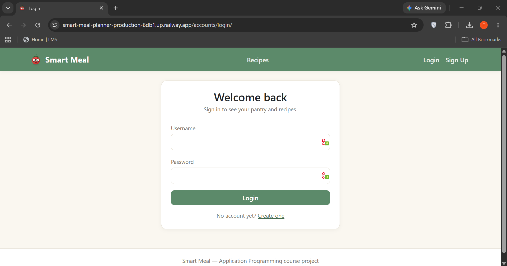

**Register**
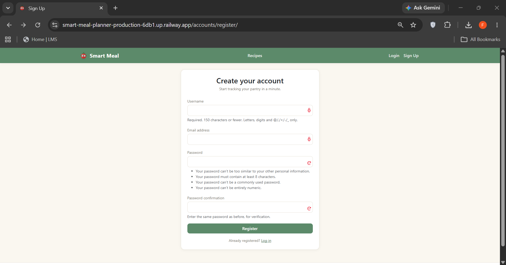

### Database Records Display

To demonstrate that these views are reading live data from the database (not hardcoded HTML), each list view is paired with the corresponding Django admin view of the same records.

**Recipe List — Frontend View (paginated, 6 per page)**
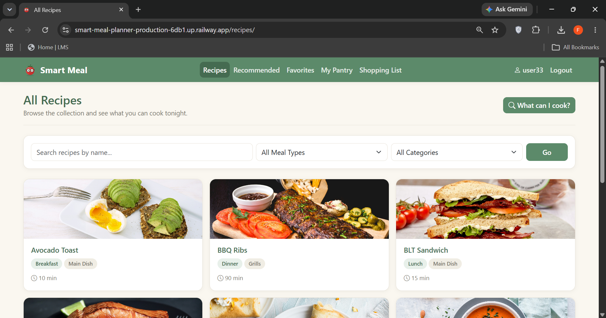

**Recipe Records — Django Admin (same data, raw database rows)**
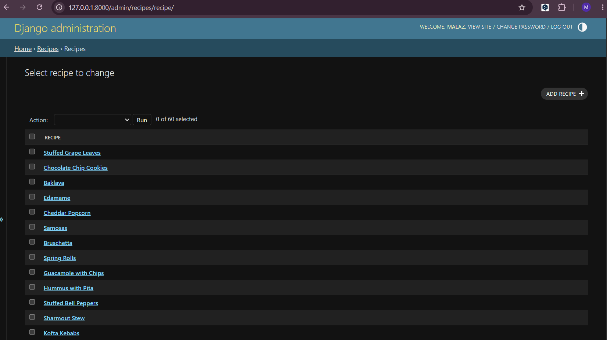

**Pantry List — Frontend View**
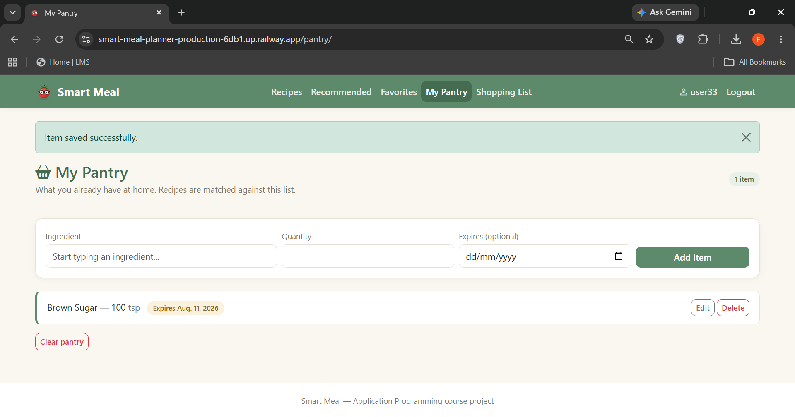

**Pantry Records — Django Admin (same data, raw database rows)**
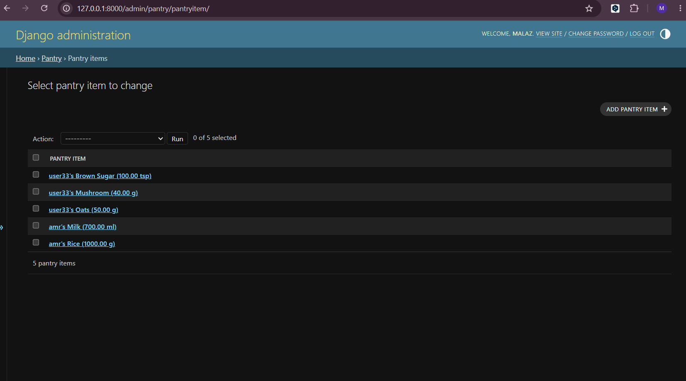

### CRUD Operation Forms

**Create — Add Pantry Item**
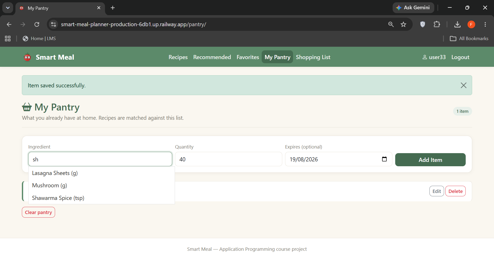

**Update — Edit Pantry Item**
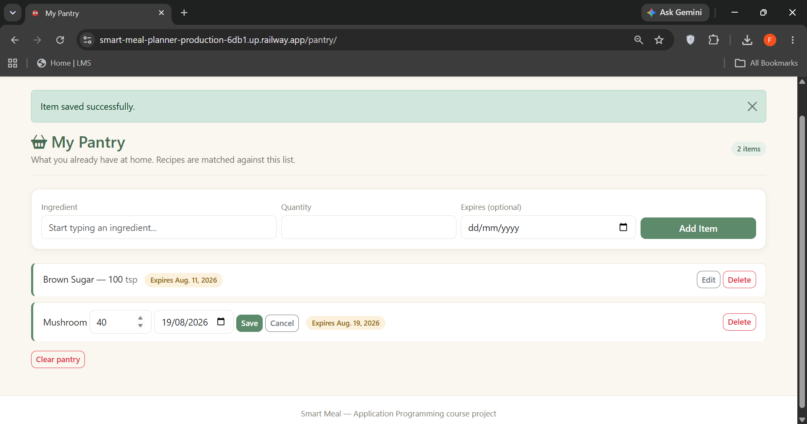

**Delete — Remove Pantry Item**
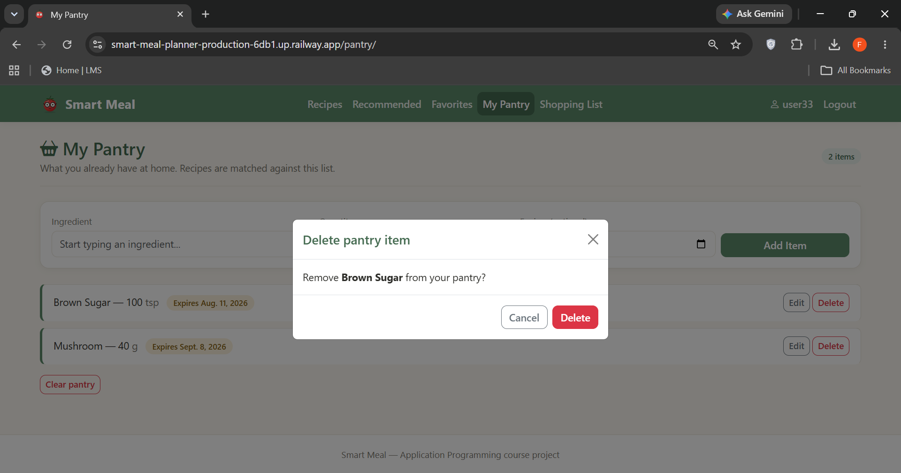

**Create — Add Shopping List Item**
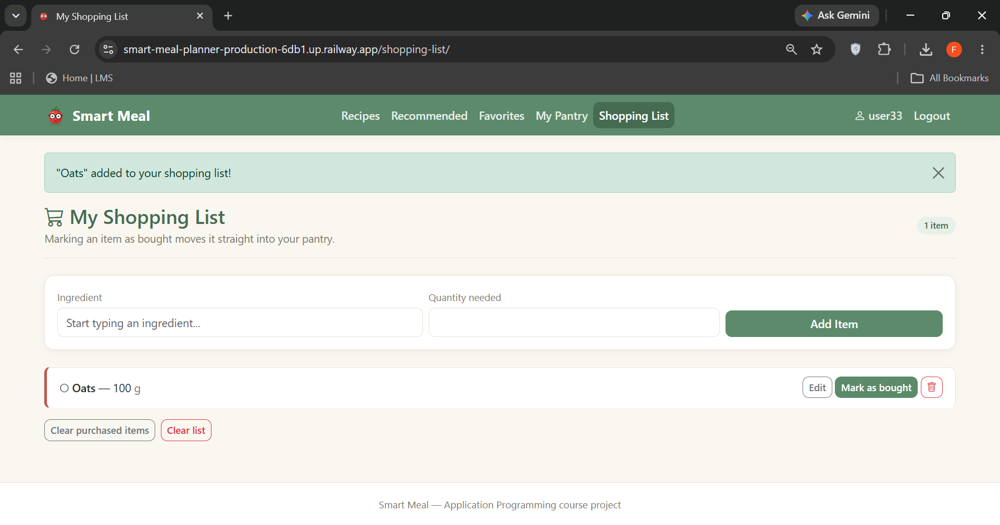

**Update — Edit Shopping List Item**
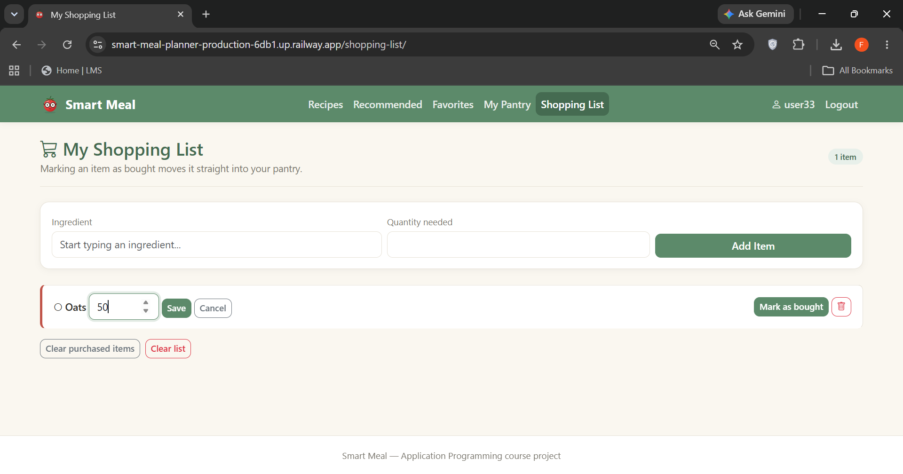

### AJAX in Action

**Live Recipe Search (no page reload)**
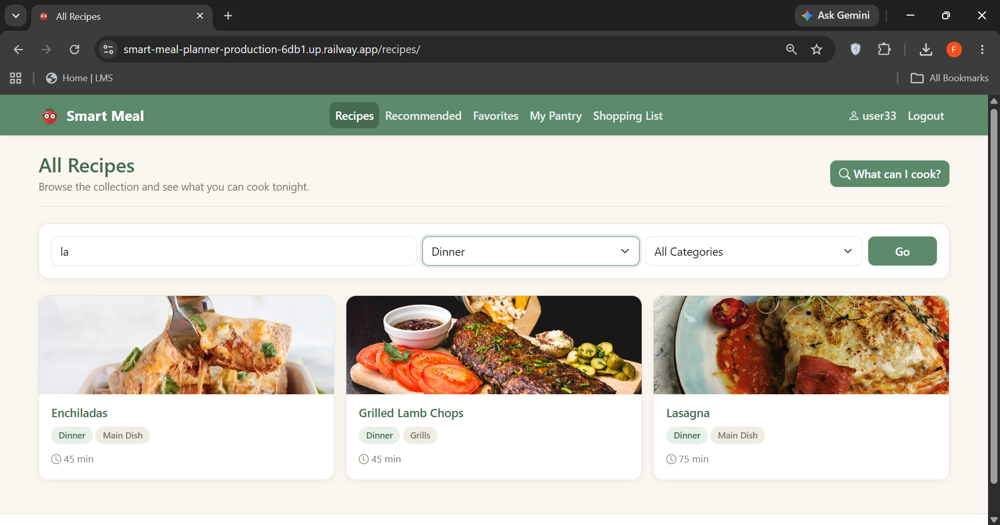

**Ingredient Autocomplete**
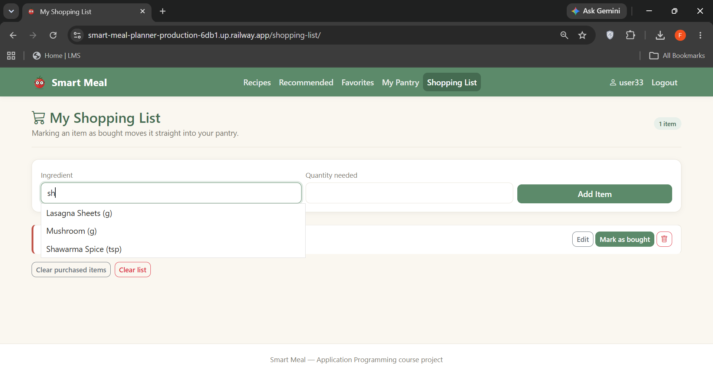

**Toggle Purchased (instant UI update)**
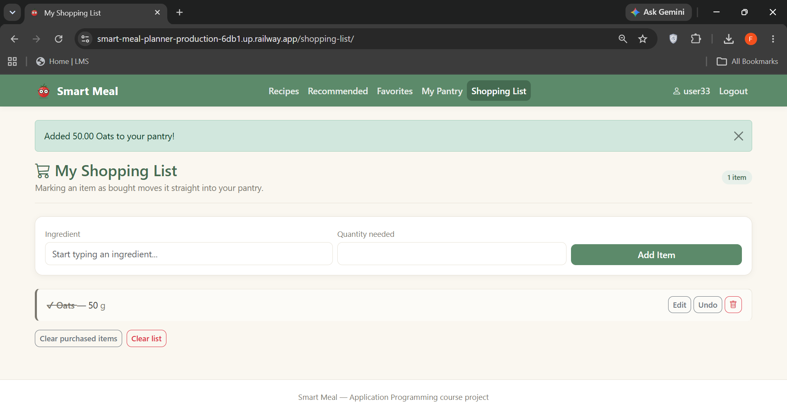

---

## Project Structure

```
smart-meal-planner/
├── accounts/             # Custom user model, auth & profile views
├── pantry/               # Pantry ingredient tracking + seed command
├── recipes/               # Recipes, ingredients, favorites + seed command
├── shopping_list/         # Shopping list items & purchase tracking
├── smartmeal/             # Django project settings, root urls, wsgi/asgi
├── templates/              # Shared base template & partials
├── static/                 # CSS and image assets
├── screenshots/             # README screenshots (see above)
├── data_recipes.json       # Seed data for recipes
├── datadump.json           # Additional data fixture
├── Dockerfile
├── docker-compose.yml
├── manage.py
└── requirements.txt
```

## Getting Started

### Option A: Docker (recommended)
```bash
docker-compose up --build
docker-compose exec web python manage.py migrate
```

### Option B: Local
```bash
python -m venv venv
source venv/bin/activate      # Windows: venv\Scripts\activate
pip install -r requirements.txt
python manage.py migrate
python manage.py runserver
```

App runs at `http://127.0.0.1:8000/` (redirects to `/recipes/`).

### Environment Variables (`.env`)
```env
SECRET_KEY=your-django-secret-key
DEBUG=True
DATABASE_URL=postgresql://<user>:<password>@<host>/<database>?sslmode=require
```

### Loading Sample Data
```bash
python manage.py seed_data      # recipes + ingredients
python manage.py seed_pantry    # sample pantry items for the first user
```

